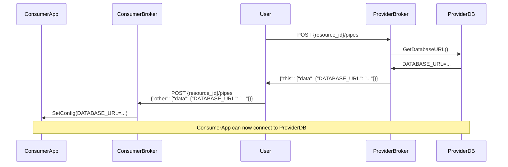
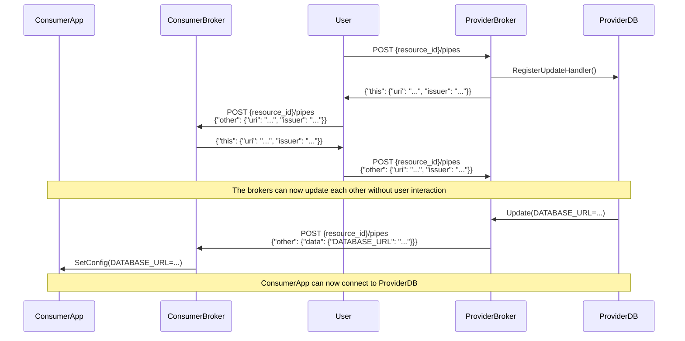
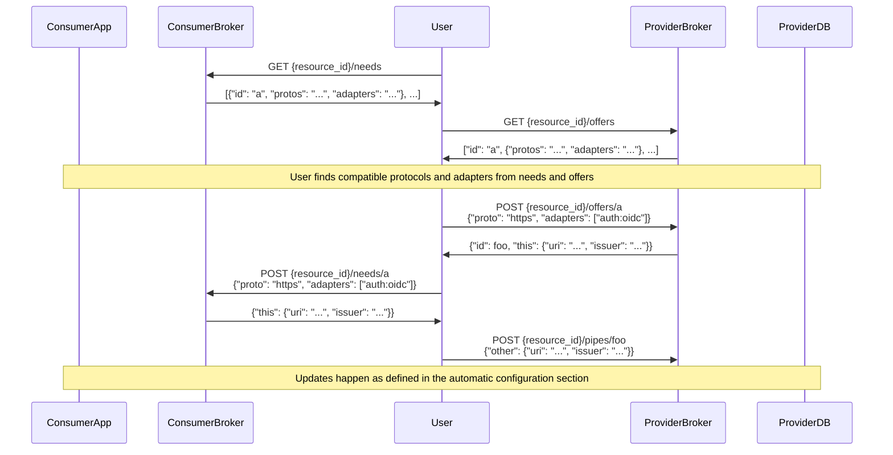

[](https://www.apache.org/licenses/LICENSE-2.0)
[](https://discord.gg/9HFMDMt95z)

# cloudpipe

### Prototype specification and implementation for twelve-factor connections

## Rationale

The twelve-factor manifesto mentions that backing services should be "accessed
via a URL or other locator/credentials stored in the config", and that "one app
can become the backing service for another app". This implies manual insertion
of connection and identity information on one or both ends of the connection.
Cloudpipe introduces a broker api to standardize the way this information is
shared between apps and backing services, so that connections between apps and
backing services can span providers and be automatically updated.

Read [CONCEPTS.md](CONCEPTS.md) for a conceptual understanding of cloudpipe,
including example use cases.

## Governance and Code of Conduct

This project follows the main [twelve-factor
governance](https://github.com/twelve-factor/twelve-factor/blob/next/GOVERNANCE.md)
including the code of conduct defined there. Because it is experimental, it
does not use the same change management or major release guidelines. Please
treat it as alpha-quality software.


## Overview
There is an associated [Open API Spec](openapi3_0.yaml). A cloudpipe broker
would implement the routes specified for all resources that it manages.

Cloudpipe brokers enable resources to share configuration data so that they can
connect to each other. The essential primitive that a broker manages is called
a `Pipe`. A pipe contains configuration data that needs to be shared with the
resource on the other end of the pipe. So a pipe has an `id` and two `Ends`:

```yaml

Pipe:
  id: string
  this: End
  other: End
```

Each `End` primarily consists of configuration `data`, but it also can
optionally have a `schema` for validating the data, and a `uri` and an `issuer`
that are used to allow brokers to update each other.

```yaml

End:
  uri: string
  issuer: string
  schema: jsonschema
  data: json
```

## Configuration Data

There are three mechanisms for creating and sharing configuration data:

1. Manual Configuration
2. Automatic Configuration
3. Blueprint Configuration

Manual configuration is the most basic and the other modes are layered on top
of the primitives that the manual mode provides. Automatic Configuration and
Blueprint Configuration can be used independently or together.

### 1: Manual configuration

In this model, the broker allows configuration data to manually configured for
the resource. The broker is responsible setting configuration values for the
resource in the `data` field of `this` end of the pipe. If the user `POST`s
configuration to the `data` field of the `other` end of the pipe, the broker is
responsible for using that data to configure the resource. So, in manual mode,
the user creates both ends of the pipe and passes the configuration data from
one end to another.

The easiest way to think about this is in the context of a heroku app and
addon. A broker for a postgres addon would expose a `DATABASE_URL` in
`this.data` and the user would manually post the url to `other.data` to a
pipe for the app broker. The app broker would provide the url to the app as a
config var. This is expressed in the following sequence diagram:



An example of this kind of manual configuration is covered in
[test-pipe.sh](test-pipe.sh).

### 2: Automatic configuration

In this model, the broker automatically updates the pipe information by sending
PATCH requests to the peer broker. It authenticates this request by providing
an OIDC token. It can also receive update requests from the peer broker and
validate the incoming OIDC token. This skips the manual sync and allows the
resource on the other end to be automatically updated whenever there is a
change. Automatic configuration is shown by the following sequence diagram:



Automatic configuration is activated by specifying the `issuer` and `uri`
fields of the `other` end of the pipe when creating the pipe. The broker will
set the subject and audience fields of the OIDC token to the values specified
in the `uri` field on each end of the pipe.

An example of this kind of automatic configuration is covered in
[test-auto.sh](test-auto.sh).

### 3: Blueprint Configuration

The brokers can provide blueprints describing the offers and needs for the
resource. These represent the type of connections that can be made to or from
the resource, allowing the user to select the optimal connection parameters.
The blueprints include schemas to ensure that the proper data is sent back and
forth.

Blueprint Configuration is implemented by providing the various `offers` and
`needs` endpoints. Creating a pipe via a blueprint is accomplished by POSTing
to the `/needs/{blueprintid}/bindings` endpoint of the consumer broker and to
the `/offers/{blueprintid}/bindings` endpoint of the provider broker. Note that
this can also include automatic configuration as mentioned above by including
the `issuer` and `uri` fields in the `other` end when POSTing. The sequence
diagram below illustrates the blueprint negotiation:



An example of creating pipes by binding to blueprints is covered in
[test-bind.sh](test-bind.sh).

